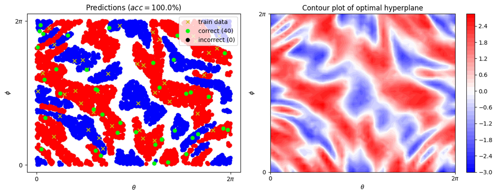
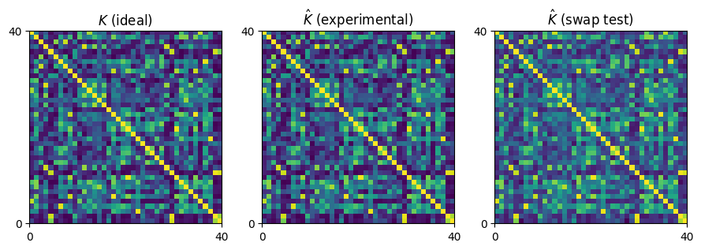

# HAQS-2022

[qBraid HAQS 2022](https://qbraid.com/haqs) (Oct 21st - Nov 5th 2022)

## QML Overall Challenge 1st Place Winner 
This repository containing solutions from team CSDL for the *Kernel Estimator* and *VQC Challenge*.

## Team CSDL
We are graduate students the Department of Electric Engineering in Pohang University of Science and Technology (POSTECH), Korea.
We are working with Prof. Seokhyeong Kang in [CAD & SoC Design Lab](http://csdl.postech.ac.kr). 
- [Dohun Kim](https://github.com/yh08037) (leader)
- [Sunghye Park](https://github.com/sunghyepark)
- Jaekyung Im

## Solutions

- [**Kernel Estimation**](qml-classifier-challenge/kernel_estimator.ipynb) (highlight)
- [VQC Challenge](qml-classifier-challenge/vqc_challenge_backup.ipynb)

